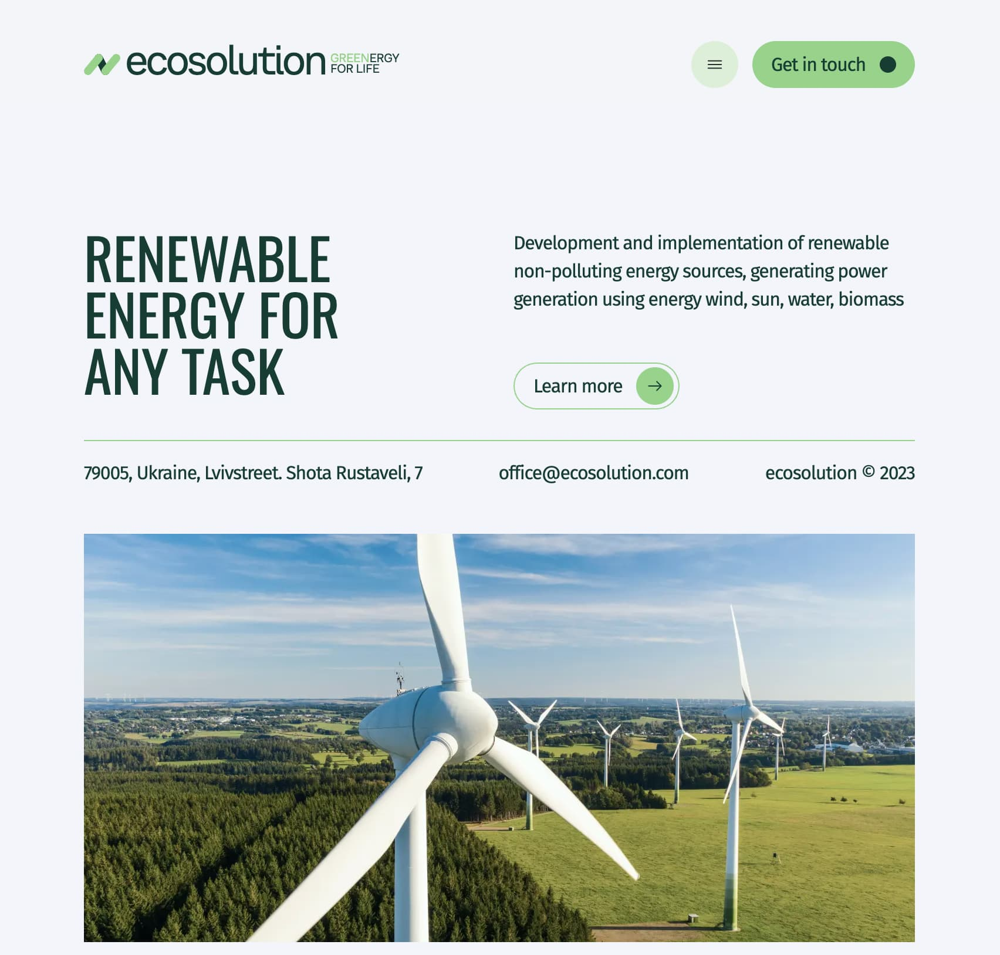

# Ecosolution

<a href="https://ecosolution-blue.vercel.app/" 
    target="_blank"
    rel="nofollow noopener noreferrer" 
    style="background-color: teal; color: white; padding: 4px; border-radius: 4px; display: inline-block; width: 100px; text-align: center">View DEMO</a>

---

A simplified landing page of a Ukrainian energy company that shows the user information about the company, its successfull work cases, main values and also provides an opportunity to apply for feedback.

## Creating

The project was built using **`npx create-next-app`**, which set up initial project structure automatically including **TS**, **ESLint**, **Tailwind CSS**, App Router, 'src/' directory and import alias (@/\*) as well. To get acquainted and configure additional features refer to [documentation](https://nextjs.org/).

It has responsive (till screen width 480px) and adaptive (more than 480px) design. General styles were created using **[Tailwind CSS](https://tailwindcss.com/)**. Some specific elements (such as pseudo-elements) were styled with **CSS**.

Image slider for section "Cases" was implemented using **[Swiper](https://swiperjs.com)**.

Contact form was created and validated using **[React Hook Form](https://react-hook-form.com/)** package.

## Dependencies and technologies

- _Next.js_
- _React.js_
- _TypeScript_
- _Swiper_
- _React Hook Form_
- _react-hook-form-persist_
- _react-toastify_
- _Tailwind CSS_

Full list of dependencies and additional information is available in **`package.json`** file.
